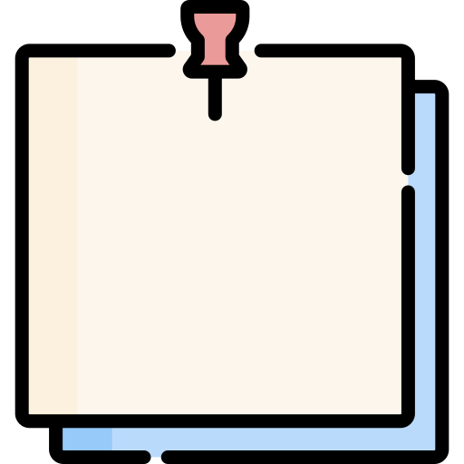

# Spaced Repetition Front

Web application for managing and reviewing notes using the spaced repetition method.

**Live demo:** [https://spaced-repetition-note.netlify.app/](https://spaced-repetition-note.netlify.app/)

## Description

This project is a web interface to manage notes and reminders, allowing users to add, review, and log daily notes. It uses the spaced repetition method to improve information retention.

## Features

- User registration and login via "nametag".
- Add new notes or reminders.
- Review pending notes for the day.
- Simple and responsive interface.
- Backend integration via REST API ([see configuration in `js/env.js`](js/env.js)).

## Usage

1. Start the local server (you can use [Live Server](https://marketplace.visualstudio.com/items?itemName=ritwickdey.LiveServer) in VSCode).
2. Open `index.html` in your browser.
3. Register with a username.
4. Add notes from the "Add" section.
5. Review your daily notes from the "Review" section.

## Technologies Used

- HTML5, CSS3
- JavaScript (ES6 Modules)
- [Google Fonts: Lato](https://fonts.google.com/specimen/Lato)
- REST API for backend (configurable in [`js/env.js`](js/env.js))
